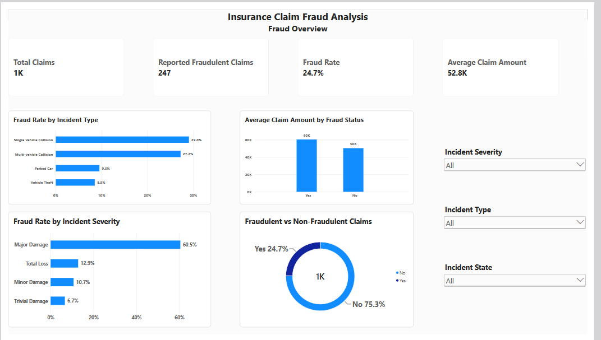
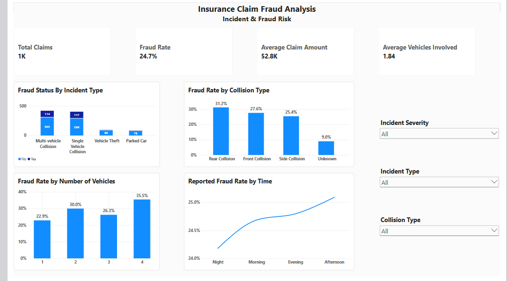
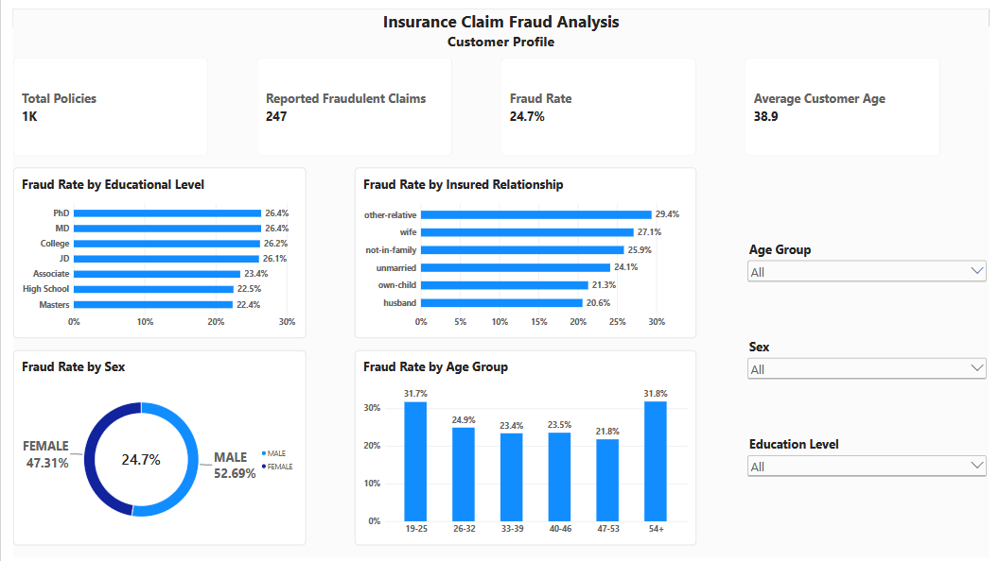
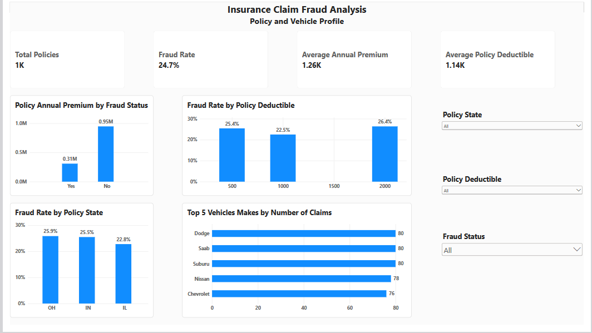

# Insurance Claims Fraud Analysis & Interactive Power BI Dashboard

## Business Question

Which incident, customer, and policy characteristics are most strongly associated with fraudulent claims, and how can an insurer use these patterns to prioritize which claims get investigated first?

## Headline Results

- Overall fraud rate was **24.7%** across **1,000 claims** (247 fraudulent).
- **Major Damage** claims have the highest fraud rate by severity, at **60.5%** — over 5x higher than Trivial Damage (6.7%).
- **Single Vehicle Collision** (29.0%) and **Multi-vehicle Collision** (27.2%) claims show far higher fraud rates than Parked Car (9.5%) or Vehicle Theft (8.5%) claims.
- **Rear Collisions** carry the highest fraud rate by collision type, at **31.2%**.
- Fraudulent claims average **$60,302** in total claim amount versus **$50,289** for legitimate claims — about **20% higher**.
- Chi-square testing shows incident severity and incident type are both **statistically significant at α = 0.05**.

## Project Snapshot

| | |
|---|---|
| **Dataset** | 1,000 insurance claims |
| **Fraud rate** | 24.7% |
| **Tools** | Excel, Power BI |
| **Analysis** | EDA + chi-square hypothesis testing |
| **Dashboard** | 5 interactive pages |
| **Geographic scope** | Illinois, Indiana, Ohio |

## Dashboard Preview



## Project Overview

This project analyzes 1,000 auto insurance claims to identify which incident, customer, and policy characteristics are most strongly associated with fraud. The project involved cleaning and preparing the dataset in Excel, running exploratory analysis and chi-square hypothesis testing, and building an interactive Power BI dashboard to explore the data and communicate key findings.

## Project Objectives

The main objectives of this project were to:

- Identify which claim, customer, and policy characteristics are associated with fraud
- Quantify fraud rate across key categorical dimensions
- Statistically test whether observed differences in fraud rate are significant, not just sample noise
- Analyze the financial profile of fraudulent vs. legitimate claims
- Build an interactive dashboard to communicate findings to non-technical stakeholders

## Tools Used

- **Excel** — Data cleaning, feature engineering, pivot tables, chi-square hypothesis testing
- **Power BI** — Data visualization and interactive dashboard design

## Dataset

The dataset contains **1,000 insurance claims and 40 columns** (39 data columns plus one blank leftover column, `_c39`, from the raw export), covering policy details, customer demographics, incident details, claim amounts, and vehicle details for policyholders in Illinois, Indiana, and Ohio.

Dataset Source: [Auto Insurance Claims Data — Kaggle (buntyshah)](https://www.kaggle.com/datasets/buntyshah/auto-insurance-claims-data)

A full column-by-column reference is in [`EDA/Data_Dictionary.md`](EDA/Data_Dictionary.md).

## Data Cleaning & Feature Engineering

Excel was used to clean the dataset and engineer features for analysis.

| Check | Result | Action |
| --- | ---: | ---: |
| Junk column | `_c39` was a fully blank leftover column from the raw export | Dropped |
| Customer tenure | Stored only as raw months as customer | Grouped into ranges (0–2, 2–5, 5–10, 10+ years) |
| Customer age | Stored only as raw age | Grouped into 6 brackets (19–25 through 54+) |
| Incident hour | Stored as a raw 0–23 hour value | Grouped into Morning / Afternoon / Evening / Night |
| Incident year | Not present in raw data | Extracted from `incident_date` |
| Vehicle age | Not present in raw data | Calculated as incident year minus `auto_year` |

After cleaning, the dataset contains 1,000 rows and 44 columns (40 original, minus 1 junk column, plus 5 engineered features).

## Analysis Performed

Fraud rate was broken down across incident characteristics (severity, type, collision type, vehicles involved, time of day), location (policy state, incident state/city), customer profile (age, sex, education, occupation, relationship to insured), and policy/vehicle attributes (deductible, CSL, tenure, vehicle age) — plus claim amount comparisons (average, min/max) by fraud status. See `EDA/` for the full pivot table breakdown across all 22 dimensions.

## Power BI Dashboard

The Power BI report contains five analysis pages. The screenshots below show each page. To interact with the dashboard, download [Insurance_Claims_Dashboard.pbix](PowerBI/Insurance_Claims_Dashboard.pbix) and open it in Power BI Desktop (free, Windows). Use the slicers and click any chart element to cross-filter the page.

### Page 1 — Fraud Overview
Provides a high-level view of fraud across the portfolio.

Key features include:
- Fraud Rate
- Total Claims
- Average Claim Amount
- Reported Fraudulent Claims
- Fraud rate by incident severity
- Fraud rate by incident type

**Insight:** Major Damage claims have a 60.5% fraud rate — over 5x higher than Trivial Damage (6.7%) — and Single Vehicle Collision is the highest-fraud incident type (29.0%).


### Page 2 — Incident & Fraud Risk
Focuses on how and when fraudulent incidents tend to occur.

Key features include:
- Fraud rate by collision type
- Fraud rate by number of vehicles involved
- Fraud rate by time of day
- Interactive slicers for incident type, severity, and state

**Insight:** Rear Collisions have the highest fraud rate among collision types (31.2%), and claims involving 4 vehicles show the highest fraud rate by vehicle count (35.5%), compared to 22.9% for single-vehicle incidents.



### Page 3 — Customer Profile
Focuses on customer demographics and their relationship to fraud.

Key features include:
- Fraud rate by age group
- Fraud rate by sex
- Fraud rate by education level
- Fraud rate by relationship to insured
- Interactive slicers for age, sex, and education

**Insight:** Fraud rate is fairly flat by sex (Male 26.1% vs. Female 23.5%), but customers aged 54+ (31.8%) and 19–25 (31.7%) show noticeably higher fraud rates than middle-aged customers (21–24%).



### Page 4 — Policy and Vehicle Profile
Connects fraud risk back to policy structure and vehicle details.

Key features include:
- Fraud rate by policy state
- Fraud rate by policy deductible
- Vehicle make breakdown
- Interactive slicers for policy state and deductible

**Insight:** Ohio has both the most policies (352) and the highest state-level fraud rate (25.9%), narrowly ahead of Indiana (25.5%) and Illinois (22.8%). Deductible level shows no clear linear relationship with fraud rate (22.5%–26.4% across $500, $1,000, and $2,000 tiers).



### Page 5 — Claims & Financial Exposure
Compares the financial profile of fraudulent vs. legitimate claims.

Key features include:
- Claim component breakdown (injury, property, vehicle)
- Average claim amount by fraud status
- Total claim amount by fraud status (100% stacked view)

**Insight:** Fraudulent claims average $60,302 in total claim amount vs. $50,289 for legitimate claims — about 20% higher — and the gap holds consistently across injury, property, and vehicle claim components.


## Statistical Testing

Chi-square tests of independence were run to check whether the patterns above are statistically significant, not just visual artifacts of the sample. χ² and degrees of freedom below were computed directly from the observed/expected values in `EDA/sta test`.

| Test | H₀ | χ² | df | p-value | Result |
| --- | --- | ---: | ---: | ---: | --- |
| Incident Severity vs. Fraud | No association | 264.24 | 3 | 5.45 × 10⁻⁵⁷ | Reject H₀ — significant at α = 0.05 |
| Incident Type vs. Fraud | No association | 29.13 | 3 | 2.10 × 10⁻⁶ | Reject H₀ — significant at α = 0.05 |

Both tests reject the null hypothesis of independence, indicating incident severity and incident type are statistically associated with fraudulent claims in this dataset.

## Key Findings

Additional patterns not already covered above:

- **Location:** Ohio has the most policies (352) and the highest state-level fraud rate (25.9%), narrowly ahead of Indiana (25.5%) and Illinois (22.8%).
- **Vehicles involved:** Claims with 4 vehicles involved show the highest fraud rate (35.5%), compared to 22.9% for single-vehicle claims.
- **Financial profile:** The gap between fraudulent and legitimate claim amounts (~20% higher on average) holds consistently across injury, property, and vehicle claim components, not just the total.

## Business Implications

These findings suggest a few directions an insurer could explore further, though none are validated as standalone fraud rules:

- Major Damage claims had the highest observed fraud rate in this dataset and could be considered for additional review.
- Incident severity and incident type could be candidate variables in a future fraud-risk model, given their statistically significant association with fraud here.
- Claim amount could be incorporated as a supplementary signal alongside incident characteristics, since fraudulent claims had higher average amounts across the dataset — not as a standalone threshold.
- A future predictive model could combine these variables and evaluate performance using proper classification metrics (precision, recall, AUC) rather than relying on descriptive fraud rates alone.

## Limitations

- Sample size of 1,000 claims is relatively small; findings may not generalize beyond this dataset.
- Geographic scope is limited to three US states (IL, IN, OH), so results may not transfer to other markets.
- The chi-square tests show statistical association, not causation — other confounding variables could be involved, and significance doesn't guarantee the pattern will hold in another dataset.
- This project is descriptive and diagnostic (EDA + hypothesis testing), not a trained predictive model.
- Fraud cases (24.7%) are a minority class; any future predictive modeling would need to account for this class imbalance.
- The dataset is a single point-in-time snapshot, so seasonal or multi-year fraud trends can't be assessed.
- This is a widely used educational/Kaggle dataset and may not reflect the scale, complexity, or fraud patterns of production insurance data.

## Skills Demonstrated

This project demonstrates practical experience with:

- **Data cleaning & feature engineering in Excel:** handling junk columns, bucketing continuous variables, deriving new features from dates
- **Pivot table-based EDA:** breaking down fraud rate across 22+ categorical dimensions
- **Statistical hypothesis testing:** chi-square test of independence, including expected value calculation and interpretation
- **Dashboard design in Power BI:** multi-page layout, KPI cards, slicers, cross-filtering
- **Data storytelling:** turning statistical output into clearly scoped business implications

## Project Structure

```text
insurance-claims-fraud-analysis/
├── README.md
├── Data/
│   └── Cleaned_Insurance_Claims_Dataset.xlsx
├── EDA/
│   ├── Data_Dictionary.md
    ├── Exploratory_Data_Analysis.xlsx
│   └── Statistical_Testing.xlsx
├── powerBI/
│   └── Insurance_Claims_Dashboard.pbix
└── Dashboard Screenshot/
    ├── page1_fraud_overview.png
    ├── page2_incident_fraud_risk.png
    ├── page3_customer_profile.png
    ├── page4_policy_vehicle_profile.png
    └── page5_claims_financial_exposure.png
```

## Conclusion

Fraud rate varies substantially across several incident characteristics in this dataset, particularly incident severity and incident type, and both associations are statistically significant. Fraudulent claims also carry consistently higher average amounts across every claim component. This project demonstrates an end-to-end fraud analysis workflow — data cleaning and feature engineering, statistical testing, visualization, and interactive dashboard development — while being explicit about what the analysis does and doesn't establish.

## Contact

**Oyindamola**

Email: [oladejoaisha7@gmail.com]

X: [https://x.com/AishatOyinda]

GitHub: [oyin948](https://github.com/oyin948)
